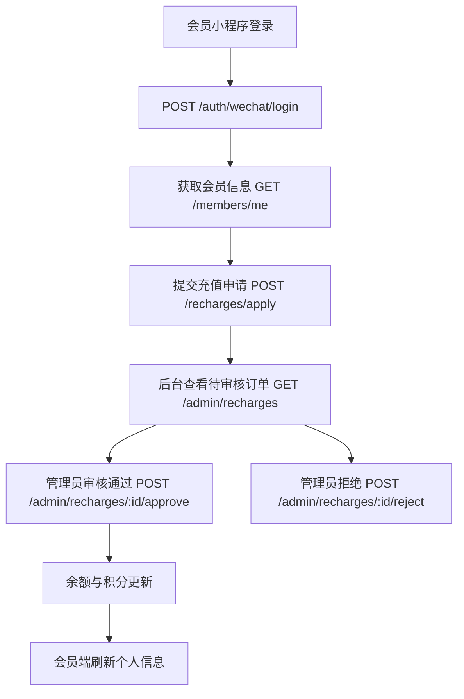

# 业务流程图

```mermaid
flowchart TD
  A[会员小程序登录] --> B[POST /auth/wechat/login]
  B --> C[获取会员信息 GET /members/me]
  C --> D[提交充值申请 POST /recharges/apply]
  D --> E[后台查看待审核订单 GET /admin/recharges]
  E --> F[管理员审核通过 POST /admin/recharges/:id/approve]
  F --> G[余额与积分更新]
  G --> H[会员端刷新个人信息]
  E --> I[管理员拒绝 POST /admin/recharges/:id/reject]
```

## 状态说明

1. `PENDING`：待审核
2. `APPROVED`：已通过，余额增加
3. `REJECTED`：已拒绝，余额不变
